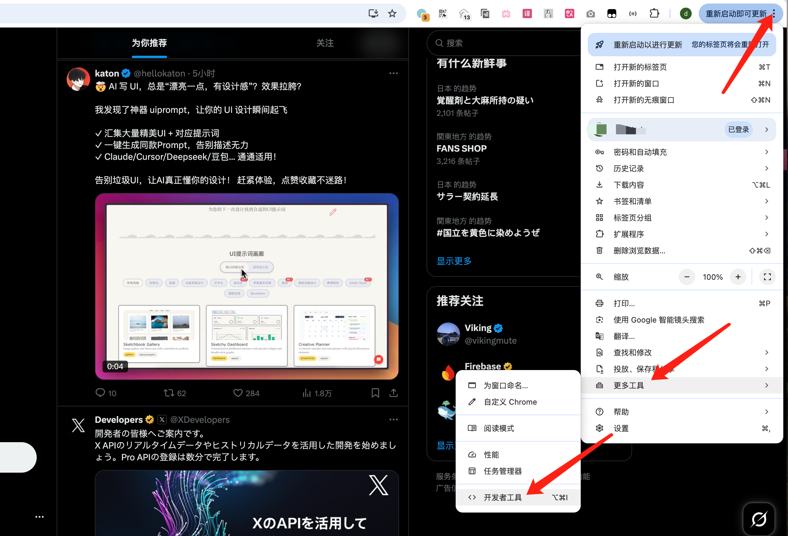
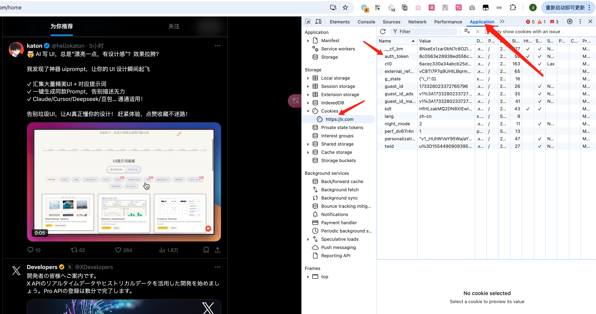

# X-Like-LLM

[中文文档](README_ZH.md)

A tool for scraping and analyzing Twitter (X) likes data.

## Features

- Scrape Twitter likes data with detailed information
- Support for both image and video content
- Automatic handling of non-viewable posts
- User avatar collection
- Data export to JSON and Excel formats
- Intelligent scrolling mechanism for large datasets
- Video content extraction and download with multiple quality options
- Beautiful frontend interface with advanced filtering and sorting capabilities

## Requirements

- Python 3.8+
- Chrome browser
- Node.js 16+
- Required Python packages:
  - selenium
  - pandas
  - tenacity
  - loguru
  - requests
  - beautifulsoup4
- Required Node.js packages:
  - react
  - tailwindcss
  - react-icons

## Installation

1. Clone the repository:
```bash
git clone https://github.com/yourusername/X-Like-LLM.git
cd X-Like-LLM
```

2. Install Python dependencies:
```bash
pip install -r requirements.txt
```

3. Install frontend dependencies:
```bash
npm install
```

4. Configure your Twitter auth token in `config.py`:
```python
TWITTER_AUTH_TOKEN = "your_auth_token_here"
```

### How to Get Twitter Auth Token

1. Open Twitter web version and log in
2. Open Developer Tools:
   - Click the settings icon in the top right
   - Select "More tools"
   - Click "Developer tools"
   <div style="text-align: center;">
   
   </div>
3. Get the Auth Token:
   - Switch to the "Application" tab in Developer Tools
   - Find and click "Cookies" on the left
   - Look for the "auth_token" item, its value is the auth token you need
   <div style="text-align: center;">
   
   </div>

## Usage

### Basic Usage

```python
from x_like_scrap import TwitterExtractor

# Initialize the scraper
scraper = TwitterExtractor()

# Fetch tweets from likes
scraper.fetch_tweets(
    "https://twitter.com/username/likes",
    start_date="2024-01-01",
    end_date="2024-04-10",
    method='remove'  # Use 'remove' for accounts with less than 1000 likes
)
```

### Data File Naming

The scraped data is saved with the current timestamp as the filename (e.g., `2024-04-10_15-30-45.jsonl`). To enable frontend display, you need to rename the data file to `x.jsonl` in the `data/` directory:

```bash
cd data/
mv 2024-04-10_15-30-45.jsonl x.jsonl
```

### Start Frontend Display

1. Start the development server:
```bash
npm run dev
```

2. Access in your browser:
```
http://localhost:3000
```

<div style="text-align: center;">
   
</div>

### Frontend Features

- Search functionality:
  - Keyword search
  - Real-time search feedback

- Advanced filtering:
  - Sorting options:
    - By date (newest/oldest)
    - By likes (most/least)
    - By retweets (most/least)
  - Numerical filters:
    - Minimum likes
    - Minimum retweets
  - Media type filters:
    - All content
    - Text only
    - Image content
    - Video content

- Pagination:
  - Customizable items per page (50/100/200/500)
  - Page navigation (first/previous/numbers/next/last)
  - Auto-scroll to top

- Card display:
  - Multiple media types:
    - Text cards (white background)
    - Image cards (yellow gradient background)
    - Video cards (green gradient background)
  - Adaptive layout:
    - Responsive grid
    - Auto-adjusting card sizes
    - Adaptive image display

### Video Download Options

#### 1. Get Video Information
```python
from x_media_scraper import get_video_info

# Get video information including all quality options
video_info = get_video_info("https://x.com/imxiaohu/status/1771521124326834465")
print(json.dumps(video_info, indent=2))
```

#### 2. Download Single Video
```python
from x_media_scraper import download_video

# Download a single video
download_video(
    "https://twitter.com/userid/status/123456789",
    "output.mp4",
    target_all_videos=False  # Set to True to download all videos in a thread
)
```

#### 3. Get Video URLs Only
```python
from x_media_scraper import get_video_url

# Get video URLs without downloading
video_urls = get_video_url("https://twitter.com/username/status/123456789")
```

## Data Structure

The scraped data includes:
- Tweet text
- Author information (name, handle, avatar)
- Post date
- Media type (Image/Video)
- Media URLs
- Engagement metrics (views, likes, retweets, replies)
- Tweet URL
- Mentioned URLs
- Video information:
  - Video URL
  - Thumbnail URL
  - Quality variants (bitrate and resolution)
  - Duration
  - Format

## Output Files

- JSONL file: Contains raw tweet data
- Excel file: Processed and deduplicated data
- Avatar JSONL: User avatar information
- Video files: Downloaded video content in MP4 format with multiple quality options

## Notes

- The tool includes mechanisms to handle non-viewable posts and rate limiting
- For large datasets, it's recommended to use the 'scroll' method instead of 'remove'
- The tool automatically handles timeouts and retries
- User avatars are saved separately to avoid duplicate fetching
- Video downloads support:
  - Multiple quality options
  - Automatic selection of best available quality
  - Concurrent downloads for efficiency
  - Retry mechanism for failed downloads
  - Support for video threads and retweets
- Failed downloads are logged and can be retried later
- Frontend display requires correct data file paths

## License

MIT License

## Contributing

Contributions are welcome! Please feel free to submit a Pull Request. 