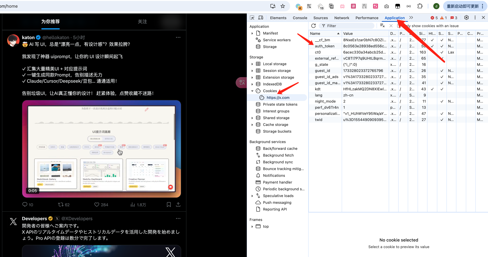

# X-Like-LLM

一个用于抓取和分析Twitter（X）点赞数据的工具。

## 功能特点

- 抓取Twitter点赞数据，包含详细信息
- 支持图片和视频内容
- 自动处理不可见帖子
- 用户头像收集
- 数据导出为JSON和Excel格式
- 智能滚动机制，支持大数据集
- 视频内容提取和下载，支持多种质量选项
- 美观的前端展示界面，支持多种筛选和排序功能

## 环境要求

- Python 3.8+
- Chrome浏览器
- Node.js 16+
- 必要的Python包：
  - selenium
  - pandas
  - tenacity
  - loguru
  - requests
  - beautifulsoup4
- 必要的Node.js包：
  - react
  - tailwindcss
  - react-icons

## 安装步骤

1. 克隆仓库：
```bash
git clone https://github.com/yourusername/X-Like-LLM.git
cd X-Like-LLM
```

2. 安装Python依赖包：
```bash
pip install -r requirements.txt
```

3. 安装前端依赖：
```bash
npm install
```

4. 在`config.py`中配置Twitter认证令牌：
```python
TWITTER_AUTH_TOKEN = "your_auth_token_here"
```

### 如何获取Twitter认证令牌

1. 打开Twitter网页版并登录
2. 打开开发者工具：
   - 点击右上角设置
   - 选择"更多工具"
   - 点击"开发者工具"
   <div style="text-align: center;">
   
   </div>
3. 获取认证令牌：
   - 在开发者工具中切换到"Application"标签
   - 在左侧找到并点击"Cookies"
   - 找到名为"auth_token"的项，其值即为所需的认证令牌
   <div style="text-align: center;">
   
   </div>

## 使用方法

### 基本使用

```python
from x_like_scrap import TwitterExtractor

# 初始化抓取器
scraper = TwitterExtractor()

# 抓取点赞推文
scraper.fetch_tweets(
    "https://twitter.com/userid/likes",
    start_date="2024-01-01",
    end_date="2024-04-10",
    method='remove'  # 点赞数少于1000的账号使用'remove'方法
)
```

### 数据文件说明

抓取的数据默认会以当前时间命名（例如：`2024-04-10_15-30-45.jsonl`）。为了支持前端展示，需要将数据文件重命名为`x.jsonl`：

```bash
cd data/
mv 2024-04-10_15-30-45.jsonl x.jsonl
```

### 启动前端展示

1. 启动开发服务器：
```bash
npm run dev
```

2. 在浏览器中访问：
```
http://localhost:3000
```

### 前端功能

- 搜索功能：
  - 支持关键词搜索
  - 实时搜索反馈

- 高级筛选：
  - 排序功能：
    - 按日期排序（最新/最早）
    - 按点赞数排序（最多/最少）
    - 按转发数排序（最多/最少）
  - 数值筛选：
    - 最小点赞数筛选
    - 最小转发数筛选
  - 媒体类型筛选：
    - 全部内容
    - 纯文本内容
    - 图文内容
    - 视频内容

- 分页功能：
  - 支持自定义每页显示数量（50/100/200/500）
  - 分页导航（首页/上一页/页码/下一页/末页）
  - 自动滚动到顶部

- 卡片展示：
  - 支持多种媒体类型：
    - 纯文本卡片（白色背景）
    - 图文卡片（黄色渐变背景）
    - 视频卡片（绿色渐变背景）
  - 自适应布局：
    - 响应式网格布局
    - 自动调整卡片大小
    - 图片自适应显示

### 视频下载选项

#### 1. 获取视频信息
```python
from x_media_scraper import get_video_info

# 获取视频信息，包括所有质量选项
video_info = get_video_info("https://x.com/imxiaohu/status/1771521124326834465")
print(json.dumps(video_info, indent=2))
```

#### 2. 下载单个视频
```python
from x_media_scraper import download_video

# 下载单个视频
download_video(
    "https://twitter.com/username/status/123456789",
    "output.mp4",
    target_all_videos=False  # 设置为True可下载线程中的所有视频
)
```

#### 3. 仅获取视频URL
```python
from x_media_scraper import get_video_url

# 仅获取视频URL，不下载
video_urls = get_video_url("https://twitter.com/username/status/123456789")
```

## 数据结构

抓取的数据包括：
- 推文文本
- 作者信息（名称、用户名、头像）
- 发布日期
- 媒体类型（图片/视频）
- 媒体URL
- 互动数据（浏览量、点赞数、转发数、回复数）
- 推文URL
- 提及的URL
- 视频信息：
  - 视频URL
  - 缩略图URL
  - 质量选项（比特率和分辨率）
  - 时长
  - 格式

## 输出文件

- JSONL文件：包含原始推文数据
- Excel文件：处理后的去重数据
- 头像JSONL：用户头像信息
- 视频文件：下载的视频内容，支持多种质量选项的MP4格式

## 注意事项

- 工具包含处理不可见帖子和速率限制的机制
- 对于大数据集，建议使用'scroll'方法而不是'remove'
- 工具自动处理超时和重试
- 用户头像单独保存以避免重复获取
- 视频下载支持：
  - 多种质量选项
  - 自动选择最佳可用质量
  - 并发下载提高效率
  - 失败重试机制
  - 支持视频线程和转发
- 失败的下载会被记录，可以稍后重试
- 前端展示需要确保数据文件路径正确

## 许可证

MIT许可证

## 贡献

欢迎提交Pull Request来改进项目！ 